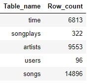
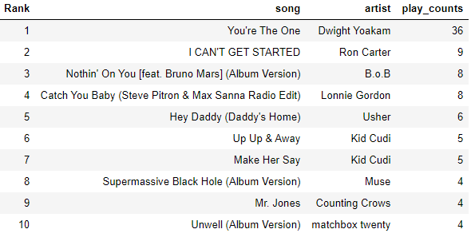

## Udacity - Data Engineering Nanodegree

### Project 3: Data Lakes with Spark on Amazon EMR

#### Table of contents

* [Project Description](#project-description)  
* [Files in Repository](#files-in-repository)  
* [Setup for Windows Operating System](#setup)  
    *   [A. Set up access keys credentials on AWS IAM](#aws_iam_access_keys)
    *   [B. Configure the credentials and the environment variables](#conf_cred_and_env)
    *   [C. Create an EC2 Login Key-Pair on AWS EC2](#ec2_key_pairs)  
    *   [D. Convert the private key (pem) file to ppk file format on PuTTYgen](#pemfile_puttygen)
    *   [E. Set permission of .pem file](#pemfile_permission)
    *   [F. Create an EMR Cluster](#create_emr_cluster)
        *   [F. 1. Create EMR Cluster](#f1)
        *   [F. 2. Change Security Groups for Master](#f2)
        *   [F. 3. Verify connection to the Master Node](#f3)
        *   [F. 4. View Spark UI hosted on the EMR clusters](#f4)
            *   [Set up an SSH Tunnel to the Master Node using Dynamic Port Forwarding](#f4_dynamic_port_forwarding)
            *   [Configure Proxy Settings in your Windows Computer (using SwitchyOmega on Chrome browser)](#f4_conf_proxy)
    *   [G. Create an S3 bucket to write parquet files](#create_S3_bucket)
    *   [H. Submitting Spark Scripts](#submit_Spark)

* [Dimensional Tables](#dimensional-tables)
* [ETL Processes and Pipeline](#etl)
* [Summary information of the tables](#summary-table-info)
* [Example Queries](#example-queries)

#### Project Description
In this project, a data lake hosted on AWS S3 and AWS EMR cluster are created to move Sparkify's growing user base and song database from data warehouse to a data lake and run big data analytics using Spark.
The main goals of this project are to build an ELT pipeline that extracts the data in JSON file format from S3, process them using Spark, and load the data back into S3 as a set of dimensional tables for the analytics team to continue analysing data and finding insights on users' music preferences.
The data will be transformed to create five different tables and written to parquet files in a S3 bucket where each table has its own folder (namely artists, songs, users, time, and songplays).

#### Files in Repository
In addition to the files in images folder, there are three other files in the
repository:
* `dl.cfg` contains AWS access keys.
* `etl.py` contains ELT pipeline where data is loaded from S3, processed into five analytics tables on Spark, and written to a S3 bucket.
* `README.md` provides discussion on this project.

#### Setup for Windows Operating System
The setup procedure to create EMR cluster and execute `etl.py` file using spark-submit command are outlined below:  

**A. Set up access keys credentials on AWS IAM.**  
As a best practice, create and use a temporary security credentials (IAM User) instead of using root user access keys which has unrestricted access to all the resources in your account. The steps to set up access keys on AWS IAM are as follows:  
1. Create an IAM user on AWS IAM.  
2. Specify user name, and access type as _Programmatic access_ only.  
3. Set the permissions to the new user by attaching _AdministratorAccess_ policy from the list and click Next.  
4. Review the details of the new user and create the new user.  
5. Download the access key in .csv file containing the _Access Key ID_ and a _Secret Access Key_.  
6. Copy and paste access keys into `dl.cfg` file.

**B. Configure the credentials and the environment variables**  
1. Now the access keys of the new user will be configured on _Command Prompt__ at your home directory by typing the following command:  
    `aws configure --profile default`  
2. Upon prompt:
    *  paste the _Access Key ID_ and _Secret Access Key_ onto the terminal,  
    *  enter default region as `us-east-1`, and  
    *  output format as `json`.
3. Next, the environment variables are configured for the default user, by typing the following command:  
    `set AWS_CONFIG_FILE=~/.aws/config`  
    `set AWS_SHARED_CREDENTIALS_FILE=~/.aws/credentials`  

**C. Create an EC2 Login Key-Pair on AWS EC2**  
*  On AWS EC2 page, navigate to `Key Pairs` under `Network & Security`.
*  Click on `Create key pair` button.
*  Enter key pair `name` and select file format of `pem`.
*  Click on `Create key pair` button.  

**D. Convert the private key (pem) file to ppk file format on PuTTYgen**  
*  Launch PuTTYgen on your desktop.  
*  Select type of key to generate as `RSA`.  
*  Select `Load` button to load an existing private key file. Change the file type to `All Files (*.*)` and open the .pem file.  
*  Click OK on the popup PuTTYgen notice window.  
*  Click on `Save private key` button.  
*  Save the .ppk file as the same filename as its .pem file.  
*  Close PuTTYgen.  

**E. Set permission of .pem file**  
On Windows 10, set the permissions of the pem file so that it is not publicly viewable, by these following steps below. This is equivalent to `chmod 400` on non-Windows machines.  
1. Right click on the .pem file.  
2. Select `Properties` then `Security`.  
3. Click `Advanced` then `Edit`.  
4. Click `Disable inheritance` and select `Convert inherited permissions into explicit permissions on this object`.  
5. Double click on SYSTEM row on Permission tab, and click on `Select a principal`.  
6. Type your account name on `Enter the object name to select` column, and click `Check Names` button and OK. Click OK to close the Permission Entry window.  
7. Repeat steps 5-6 for Administrators.  
8. Double click on Owner account on Permissions tab, and untick all Basic permission boxes except for Read box. Click OK.  
9. Click `Apply` button then `OK` until the Advanced Security Settings window is closed.   

**F. Create an EMR Cluster**  
The steps below shows how to create an EMR Cluster:  

__*F. 1. Create EMR Cluster.*__  
Navigate to AWS EMR page and click `Create cluster` button
*  In _General Configuration_:  
      - Specify a `Cluster name`.  
      - Leave the `Logging` option ticked and S3 folder to the default directory where the cluster log files will be saved.  
      - Set `Launch mode` to Cluster.  
*  In _Software configuration_:  
      - Select `Release` of emr-5.28.0.  
      - Set `Applications` to Spark: Spark 2.4.7 on Hadoop 2.10.1 YARN and Zeppelin 0.8.2.  
*  In _Hardware configuration_:  
      - Select `Instance type` of m5.xlarge.  
      - Set `Number of instances` to 4 (1 master and 3 core nodes).  
*  In _Security and access_:  
      - Select `EC2 key pair` of the key pair (.pem file) created in _[Step C](#ec2_key_pairs)_ above.  
      - Leave the `Permissions` to default.  
      - Leave `EMR role` and `EC2 instance profile` to default.  
      By default, _EMR_DefaultRole_ has permission policies of:  
          * AmazonElasticMapReduceEditorsRole  
          * AmazonElasticMapReduceRole and  
          * AmazonS3FullAccess.     

          while _EMR_EC2_DefaultRole_ has  
          * AmazonElasticMapReduceforEC2Role
          * AdministratorAccess.  

*  Click `Create cluster` button.

___F. 2. Change Security Groups for Master___  
After the EMR cluster is successfully launched, the setting in `Security Groups for Master` needs to be set to accept incoming SSH protocol from your local computer.  
- Click on link of **Security Group for Master** under _Security and access_.  
- Select Security group ID which name is ElasticMapReduce-master.  
- Click on `Inbound rules` tab, then on `Edit Inbound rules`.  
- Click `Add rule` button. Select _SSH_ in `Type` and _My IP_ in `Source type`.  
- Click `Save rules`.  

___F. 3. Verify connection to the Master Node___  
On Windows machine, an SSH client such as PuTTY is used to connect to the master node. The steps of converting private key (ppk file) _([Step D](#pemfile_PuTTYgen))_ and authorizing inbound traffic _([Step F.2](#f2))_ should be completed before attempting to connect to the master node. The steps to connect to the master node are as follows:  
1. Launch PuTTY program on your desktop.  
2. Navigate to _Session_ in _Category_ list.  
3. On the newly created EMR cluster page, copy the Master public DNS. In Host Name box, type `hadoop@MasterPublicDNS`, swap `MasterPublicDNS` with the copied Master public DNS.
4. Next, navigate to _SSH_ > _Auth_ on the _Category_ list.
5. For _Private key file for authentication_, click on `Browse` button and select the `.ppk` file generated in _Step D_.  
6. Select _Open_ and then _Yes_ to dismiss the PuTTY security alert.  
7. To retrieve the cluster identifier, run the following command on the master node:  
    `[hadoop@ip-xxx-xx-xx-xxx ~]$ aws emr list-clusters`  
8. When you are done working on the master node, the SSH connection can be ended by closing PuTTY.  

___F. 4. View Spark UI hosted on the EMR clusters___  
In order to view Spark UI on web browser, a proxy in the your browser needs to be set up. This is a two-step process that involves setting up an SSH tunnel to the master node using dynamic port forwarding and configuring proxy settings in your Windows machine.  

* Set up an SSH Tunnel to the Master Node using Dynamic Port Forwarding  
  1. Launch PuTTY program on your desktop.  
  2. Navigate to _Session_ in _Category_ list.  
  3. On the newly created EMR cluster page, copy the Master public DNS. In Host Name box, type `hadoop@MasterPublicDNS`, swap `MasterPublicDNS` with the copied Master public DNS.
  4. Next, navigate to _SSH_ > _Auth_ on the _Category_ list.
  5. For _Private key file for authentication_, click on `Browse` button and select the `.ppk` file generated in _Step D_.
  6. Navigate to _Connection_ > _SSH_ > _Tunnels_ in the _Category_ list.  
  7. Select _Dynamic_ and _Auto_ radio buttons.  
  8. In the _Source port_ field, type `8157` then click `Add` button.
  9. Select _Open_ and then _Yes_ to dismiss the PuTTY security alert.  

  With PuTTY program still running, copy `.pem` file (created in _[Step C](#ec2_key_pairs_)_) from local machine to the master node by running the following commands in Command Prompt:  
      `scp -i ./filename.pem filename.pem hadoop@ec2-xx-xxx-xxx-xxx.us-east-2.compute.amazonaws.com:/home/hadoop/`  

  Now, copy `etl.py` and `dl.cfg` files from local machine to master node with the following command in Command Prompt:  
      `scp -i ./filename.pem etl.py dl.cfg hadoop@ec2-xx-xxx-xxx-xxx.us-east-2.compute.amazonaws.com:/home/hadoop/`  

  Verify that the files have been copied across successfully by executing `ls` command on the master node as such:  
      `[hadoop@ip-xxx-xx-xx-xxx ~]$ ls`  

  A `.pem` file, `etl.py` and `dl.cfg` should be shown as the output.  

* Configure Proxy Settings in your Windows Computer (using SwitchyOmega on Chrome browser)  
  1. Navigate to  https://chrome.google.com/webstore/category/extensions, and add _Proxy SwitchyOmega_ extension to Chrome browser.  
  2. Create a new profile with name `emr-socks-proxy` and select _PAC profile type_.  
  3. Copy and paste the following profile script to _PAC Script_ field of the `emr-socks-proxy` profile.   
   >              function FindProxyForURL(url, host) {  
   >              if (shExpMatch(url, "*ec2*.amazonaws.com*")) return 'SOCKS5 localhost:8157';  
   >              if (shExpMatch(url, "*ec2*.compute*")) return 'SOCKS5 localhost:8157';  
   >              if (shExpMatch(url, "http://10.*")) return 'SOCKS5 localhost:8157';  
   >              if (shExpMatch(url, "*10*.compute*")) return 'SOCKS5 localhost:8157';  
   >              if (shExpMatch(url, "*10*.amazonaws.com*")) return 'SOCKS5 localhost:8157';  
   >              if (shExpMatch(url, "*.compute.internal*")) return 'SOCKS5 localhost:8157';  
   >              if (shExpMatch(url, "*ec2.internal*")) return 'SOCKS5 localhost:8157';  
   >              return 'DIRECT';  
   >              }  

  4. Enable the `emr-socks-proxy` profile.  
  5. Once the proxy on web browser is configured, Spark UI can be accessed on the following address:  
      `http://ec2-xx-xxx-xxx-xxx.us-east-2.compute.amazonaws.com:18080/`  

      The page will currently show _No completed applications found_ because Spark script (`etl.py`) has not been executed.  

**G. Create an S3 bucket to write parquet files**  
Before running `etl.py`, create an S3 bucket which bucket name specified in `etl.py` as directory where to write the parquet files of the five tables. Subfolders within the bucket to contain each table will be created automatically so there is no need to add any folders in the newly created S3 bucket.  

**H. Submitting Spark Scripts**  
Before spark-submit `etl.py`, run the following commands consecutively in the master node to set Pyspark environment and install configparser and pandas packages:  
    `sudo sed -i -e '$a\export PYSPARK_PYTHON=/usr/bin/python3' /etc/spark/conf/spark-env.sh`  
    `sudo python3 -m pip install configparser pandas`  

Run the following command in the master node to get directory of spark-submit:   
    `which spark-submit`  
The output should be _/usr/bin/spark-submit_  

Finally, run the following command in the master node to execute Spark script:  
    `/usr/bin/spark-submit etl.py`  

#### Dimensional Tables
The tables created and written to the S3 bucket consist of:  

1. **songs** - songs in music database, partitioned by _year_ and _artist_id_
    * _song_id, title, artist_id, year, duration_

2. **artists** - artists in music database
    * _artist_id, name, location, latitude, longitude_

3. **users** - users in the app
    *  _user_id, first_name, last_name, gender, level_

4. **time** - timestamps of records in songplays broken down into specific units, partitioned by _year_ and _month_
    *   _unix_timestamp_ms, start_time, hour, day, week, month, year, weekday_

5. **songplays** - records in log data associated with song plays i.e. records with page `NextSong`, partitioned by _year_ and _month_
    *   _songplay_id, start_timestamp, user_id, level, song_id, artist_id, session_id, location, user_agent_

#### ETL Processes and Pipeline
Songs and event logs datasets in JSON format are read from S3 and saved as its own dataframe. The ETL process and pipeline for each of the datasets are as follows:  
1. **ETL Process on songs dataframe**  
    Fields for each _songs_ and _artists_ tables are specified. Each table is essentially subset of the songs dataframe where _song_id_ and _artist_id_ fields are not null, and duplicate rows are dropped.  
    The tables are written as parquet files into its own subfolder in the S3 bucket.  

2.  **ETL Process on log events dataframe**  
    Each of the log JSON file contains multiple logs of users activity on the music app on the
    day. The _users_ table is processed in the same manner as _songs_ and _artists_ tables where the fields are specified and is essentially a subset of the log event dataframe with duplicate rows removed.  
    The unix timestamp is parsed to `YYYY-mm-DD HH:MM:SS` format using an user-defined function. The hour, day, week, month, year, and weekday elements of the timestamp are extracted to create the _time_ table.  
    The _songplays_ table is created from (inner)joining log dataframe and  _song_ table which records have matching values of song titles and song duration. The ,  s\.      They are inserted into the `users`, `time` and `songplays` tables.

#### Summary information of the tables
The summary information of each table created is as follow:  

#### Example queries

Below are screenshots of some of the SQL queries:  

***Top 10 most-listened-to artists in November 2018***  

***Top 10 most-listened-to songs in November 2018***  

